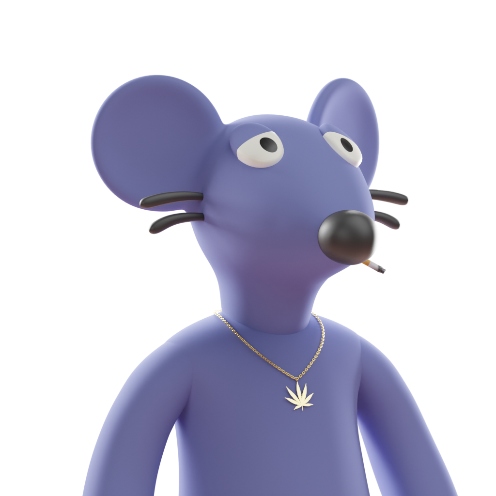

# 🎲 P2E GAME MECHANICS

May the strongest Rat win

The Rogue Ratz economy rewards gangs based on their total score at the end of each game.

Games run for 2 months - this period is called a **Game round**.

Points are scored through gang upgrades, upgrades are purchased through the Gang buy menu & Gang DAOs.

**Gang round**

- The game period is called a **Gang Round**
- **Gang Rounds** lasts for 2 months
- At the end of the **Gang Round** the gang with most points wins
- The winning **gang members** receive bonus rewards for the next round
- The winning **gang community wallet** receives bonus reward for the next round

**Points**

- Points are tallied up at the end of every gang round
- Points are earned by purchasing **upgrades**
- Gangs compete to have the most points at the end of every round

**Upgrades**

- Upgrades are purchased using $CRED
- There are 2x ways to buy upgrades
- Upgrades can be purchased by individual gang members - these upgrades reset at the end of every round
- Upgrades can be purchased by the DAO - these upgrades are permanent# 🎲 P2E GAME MECHANICS

May the strongest Rat win

The Rogue Ratz economy rewards gangs based on their total score at the end of each game.

Games run for 2 months - this period is called a **Game round**.

Points are scored through gang upgrades, upgrades are purchased through the Gang buy menu & Gang DAOs.

**Gang round**

- The game period is called a **Gang Round**
- **Gang Rounds** lasts for 2 months
- At the end of the **Gang Round** the gang with most points wins
- The winning **gang members** receive bonus rewards for the next round
- The winning **gang community wallet** receives bonus reward for the next round

**Points**

- Points are tallied up at the end of every gang round
- Points are earned by purchasing **upgrades**
- Gangs compete to have the most points at the end of every round

**Upgrades**

- Upgrades are purchased using $CRED
- There are 2x ways to buy upgrades
- Upgrades can be purchased by individual gang members - these upgrades reset at the end of every round
- Upgrades can be purchased by the DAO - these upgrades are permanent

