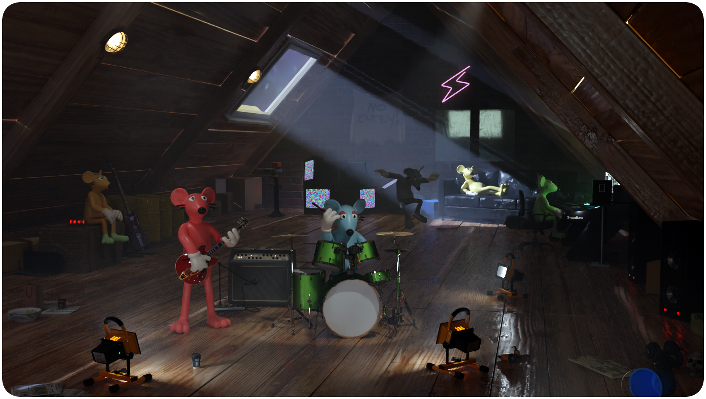

---

# Staking

The $CHEESE Token will be used to power the Rogue Ratz Economy, and also be supported by a liquidity pool with a real-world value.

$CRED will be used to buy upgrades for gangs in the Rogue Ratz economy.
$CHEESE can be converted to $CRED 

$CHEESE can be exchanged to $CRED which can be used in the Ratz economy to buy upgrades, equipment and infrastructure to build up gangs. 

## $CHEESE

Each gang is managed by a DAO - Gang Bosses and Gang members need to work together to build the strongest sustainable gang. Gang Bosses will be able to make proposals to the Gang DAO whilst Gang Members will be able to vote on these proposals.

Each gang member can buy upgrades for their gang, for example weapons, Ammo & Medkits. Big ticket strategic purchases are made by the Gang DAOs. These upgrades have a much larger effect on the gangs success such as Moonshine Distilleries, Skateparks & other infrastructure. 

The strongest gang will take all the cheese.

## $CRED
