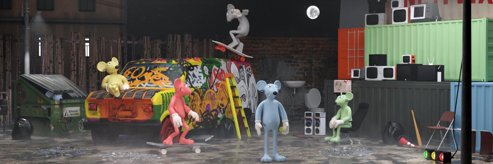

# The Crooks

Self-proclaimed Hillbilly Rogue Ratz seek a simple life

By Serena Massof

Investigative Reporter

SOLANA CITY— “If your life was as short as mine, wouldn’t you spend it having fun, too?” said Hillbilly Harold Havarti. 

This seems to be a common sentiment among the self-proclaimed Hillbilly gang of the Rogue Ratz. The gang, who are known for their laid-back attitudes, country music, and potent moonshine, said they just want to live a simple life and enjoy themselves. 

The Hillbillies don’t have much in the form of written history, but they do have a series of rather moving oral histories set to song. While they are considered uneducated, this reporter found many of them to be intelligent and talented musicians. They are, however, utterly uninterested in a structured way of life. 

Power has never been an issue in the sewers, and thanks to the Crooks’ smuggling connections, most of the Ratz are frequent consumers of television and video games. Hillbillies founder Billy Brie was always a fan of the Dukes brothers and had long been a lover of the dulcet tones of banjo music. When he discovered a banjo floating in the sewer rapids, Brie swam out to get it. According to Hillbilly history, Brie strummed the strings and knew it was destiny.

Brie taught himself to play the theme song from his favorite show and the sweet sounds of his banjo drew in others. Soon, a group had formed, and it wasn’t long until the moonshine still started brewing and a deal was made to sell it on the black market. Members of the Hillbillies said they do whatever they want, and they make moonshine to pay the bills. Several members said they would be interested in expanding their territory to increase the booming moonshine business. 

Rumors among the Ratz say Solana City’s new mayor is a shareholder in the Hillbillies’ moonshine business. Perhaps relations with the surface are further along than they seem?

When visiting the Hillbillies, expect to see sewer rapid surfing, video game tournaments, and Ratz living their lives to the fullest. While this group has no interest in migrating to the surface, many said they wouldn’t mind being allowed to visit now and then. Particularly to perform with the other musicians at the Solana City Park and to test the merit of their moonshine against the best humanity has to offer. 

Their hobbies include playing music— especially the banjo— drinking moonshine, grilling up some delicious Halloumi cheese, and gathering for their weekly stand-up comedy nights. Hillbillies can also often be found practicing their marksmanship on bottles at their shooting range. 

The Hillbillies live under one of the oldest bakeries in Solana City. Havarti said the location allows access to yeast, which is a necessary ingredient in the potent moonshine they produce. The Hillbillies’ area of the sewers shines with yellow, recalling lazy, laid-back sunny days. They also prefer denim overalls with yellow shirts. 

Several members of the Hillbillies said they are more content than their Rogue Ratz counterparts because they don’t focus on ambition. Their personalities tend toward a relaxed attitude and a simple manner. They are hard-working people who are generally friendly but don’t hesitate to retaliate once they’ve been crossed. They are, however, territorial and don’t appreciate unwelcome visitors.  

“When y’all keep life simple, it’s not hard to be happy,” said Hillbilly Jethro Feta. “The secret is not to want too much. A well-tuned banjo, some strong bleu cheese, and friendly company. That’s all y’all need.”

