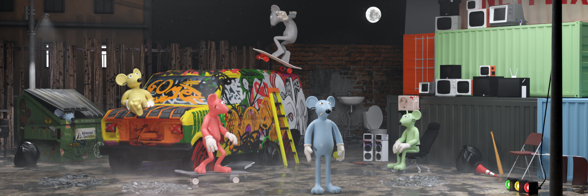

# Sewer Rats

All Ratz begin their life as a common Sewer Rat, not affiliated with any gang. Through staking, Sewer Ratz earn $CREDZ.

CREDZ have two main uses, upgrading your Sewer Rat into a Gang Rat or supporting your favourite Gang in the Turf Warz (more on that later)
        
| Pool Name | WL NFT | Reward token | Reward multiplier | Lock period |
| --- | --- | --- | --- | --- |
| 15 Day - Sewer Ratz | All | $CREDZ | 1x | 15 days |