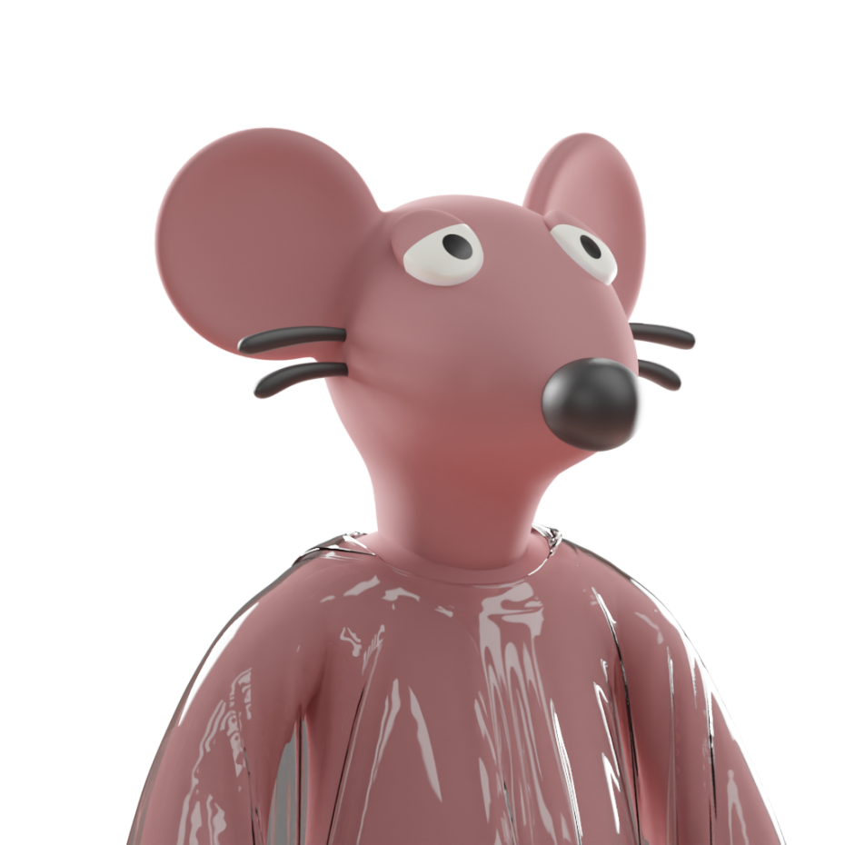

# The Rogue Ratz Community

**The Rogue Ratz Community**

!!!
The first point to cover - The supply of Rogue Ratz
!!!

In Solana’s low-supply WL meta we are often asked - "Why 4,848?"

Here's what drives our decision:

- Community
- Unique Characters
- Deflationary Supply
- Evolution
- Utility
- Financial Reward

The Rogue Ratz project is building a vibrant community, one that attracts unique holders through engaging storylines and fantastic utility which will reward our community financially.

The team is aiming for a high level of unique holders, to enable the most dedicated and active community members to share in the riches of the Solana Sewers. 

As Rogue Ratz will be a deflationary supply, there is incentive to introduce a higher number of Ratz to the Solana Network initially. The end supply of Rogue Ratz will be XXX meaning that the battle for $CREDZ and $CHEEZE will be a fierce battle but offer high rewards to those who make it to the top!

The Rogue Ratz Motto: 

# Unique Artwork:

Talking about variety we must first let's look at our traits for the 5,000 Vanguards:

- Backgrounds: X
- Gangs: 3 
- X:X
- X:X
- X:X

- Super Rares: X

X unique combinations - One of the largest collections to date

# Deflationary Supply:

Rogue Ratz is bringing gang warfare to Solana. The three gangs are compromised of criminals, each with their own skillset and a desire to be the best.

As criminals take arms to protect their turf and gain power in a search for glory and riches there will be casualties.

Only a few will make to the top, and those who do will be rewarded. 

The intial supply of Rogue Ratz will be 4,848.

The end supply of Rogue Ratz will be XXX.

Fuse your Rogue Ratz civilians together to complete your gang initiation, and fuse your gang Ratz together to become a Gang Boss.

# Evolution:

The deflationary supply for Rogue Ratz is explained by the Evolution Mechanic as the Rogue Ratz civilians are transformed into Gang Bosses.

**Upgrading Rogue Ratz** 

1. Mint a Rogue Rat - Ratz start off as **Civilian Ratz**
2. Stake your **Civilian Ratz** to get $CREDZ
3. Use $CREDZ and 2x Civilian Ratz to complete your gang initilation and receive a **Gang Ratz**
4. Stake Gang Ratz to get $CHEEZE
5. $CHEEZE + 3x Gang Rat = **Gang Boss**

In short: 2x Civilians Ratz = Gang Rat &  3x Gang Ratz = Gang Boss

This mechanism will reduce the supply to 1/6th of the original supply - A end supply of 804.

# Utility:

This Whitepaper will go through all the fantastic utility that Rogue Ratz is introducing.

The Rogue Ratz team believes that fantastic artwork needs to be supported by fantastic utility that provides amazing value back to a dedicated communtiy. 

The team is heavily investing into the project roadmap, to ensure that the holders are rewarded financially and find themselves a home within the Solana Sewers. 

Here's an overview of the utility the Rogue Ratz team will introduce:

- P2E within a fully fledged economy
- Liquidity based rewards - Trade rewards for $USDC
- Decentralised Gang Mechanics DAO
- Fusion & Deflationary mechanisms
- RogueRatz Raffles
- RogueRatz Auction house
- Augmented Reality integration

# Financial Reward:

Gang Ratz and Gang Bosses will earn $CHEEZE when staked.

$CHEEZE will be backed by a liquidity pool, enabling you to convert $CHEEZE to USDC on Radiyum.

As you move up within a gang, your $CHEEZE reward will increase. 

---
This is just the tip of the iceberg, over the next few pages we will dive into greater depth!

Let's jump into the fundamentals: The Rogue Ratz Community