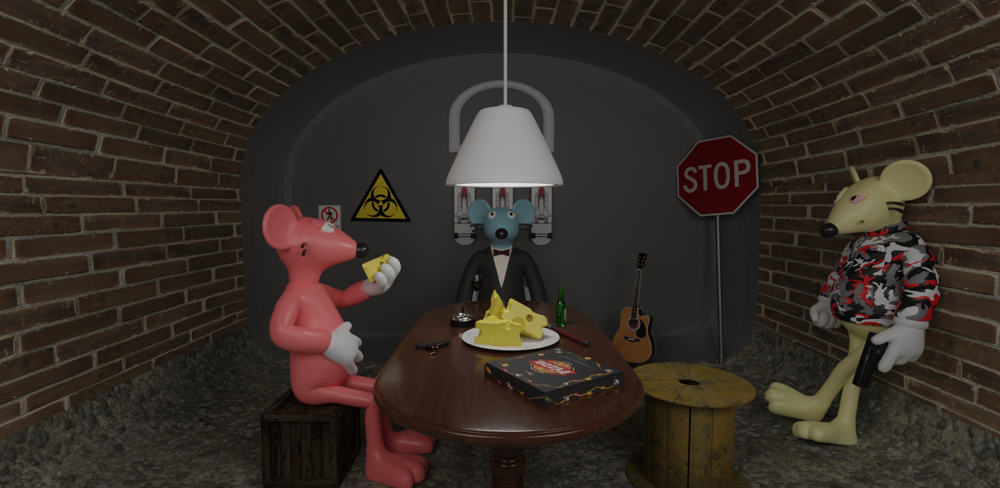

# Who are the Rogue Ratz?

**Who are the Rogue Ratz?**

Rogue Ratz is a collection of 4,848 unique and aesthetically pleasing 3D Ratz. The Rogue Ratz exist within the underworld of Solana, living life in the Solana Sewers and their world is encompassed by gangs battling for power. 

As the Solana universe rapidly expanded above ground, commercial greed escalated and companies started storing nuclear waste in the sewers to save on costs.  During this time, the radioactive waste in the sewers had cause the common rats to mutate into what we now know as the Rogue Ratz.

The Rogue Ratz are a species of mutated rodents living in the Solana Sewers. Appearances aside, they are mostly decent creatures, living life to the fullest through any means necessary. 

In their leisure time the Rogue Ratz enjoy surfing the sewer rapids, skating around, relaxing on lawn chairs, playing music, tripping out, playing video games, smoking up and sleeping.

However, it's not all fun and games within the sewers. There are three main gangs that exist within the Rogeu Ratz underworld: The Academics, The Crooks and the Hillbillies. 

These gangs all have an expansive history, unique culture and fascinating identity. There is a sense of community and belonging within each gang, however, their pleasantries don't extend to their rivals. 

The three gangs are locked in a brutal turf war, as greed has taken over and the fight for ***$CHEEZE*** is never-ending. 

[!badge The Rogue Ratz need help, choose your side and lead your gang to victory to earn your share of riches. ]

The Rogue Ratz P2E Model will empower holders to stake, evolve and work their way up the in their respective gang to achieve power and extrodinary wealth. 

The Rogue Ratz economy is supported by a dual-token model. Rogue Ratz will earn $CREDZ which can be used to partake in gang initiation, take out your competition and work your way up the ladder. Once you've proven yourself to represent one of the Hillbillies, the Academics or the Crooks you'll be earning $CHEEZE which is backed by a liquidity pool.

Rogue Ratz introduces fantastic utility, amazing earning potential, and an engaging storyline as well as a vibrant community.

# Overview:

**Here’s what you can expect**

- P2E within a fully fledged economy
- Liquidity based rewards - Trade rewards for $USDC
- Decentralised Gang Mechanics DAO
- Fusion & Deflationary mechanisms
- RogueRatz Raffles
- RogueRatz Auction house
- Augmented Reality integration

---
[!badge This is just the tip of the iceberg, over the next few pages we will dive into greater depth!]

Let's jump into the fundamentals: The Rogue Ratz Community