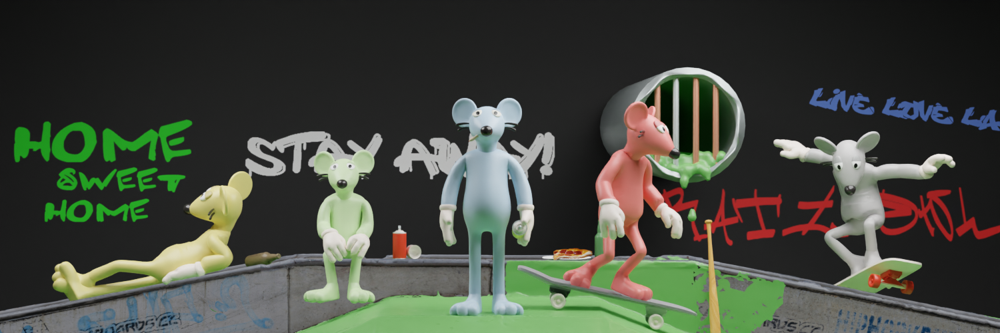

# Welcome to Rogue Ratz

Rogue Ratz is a collection of 4,848 rodents living in the Solana Sewers. 

Rogue Ratz will be encompassed by engaging lore, exciting and unique artwork as well as P2E mechanisms along with cutting edge utility. 

The Rogue Ratz world exists in the underworld of Solana, they’ve created a city of their own. The Solana Sewers are filled with life and culture which you’ll find navigating through the ever changing, disorientating and expansive network of tunnels that exists below ground. 

The Rogue Ratz univerise is a never ending turf war between three gangs. The fight for $CREDZ and $CHEEZ keeps crime rates high and the civilians on edge. These gangs battle for power, street cred and riches. 

Choose between the Crooks, the Hillbillies or the Academics Gang - Choose your side and lead your gang to victory! 

# Quick Info:

Only got a minute? Check out the critical information for Rogue Ratz 

* INSERT BANNER * 

**What you need to know:**
Mint Split:

Resale distribution:

Full Release: TBC

Total Supply: 4,848

Launch Site: 

Price: TBC

Resale Royalties: 6%

Discord

Twitter

Website

This is a paragraph.

---

!!!
Want to know more? Dive into our comprehensive whitepaper and explore the RogueRatz world!
!!!
